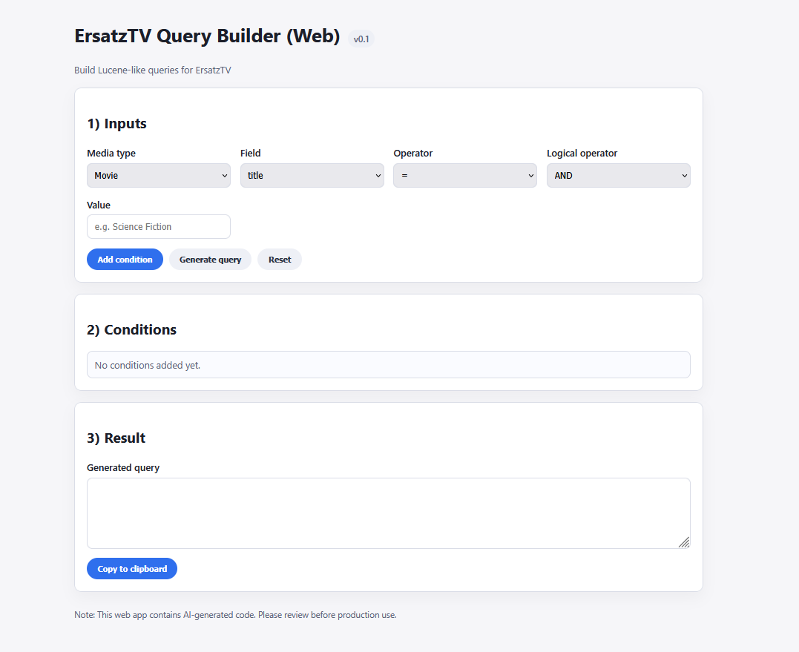

# ErsatzTV Query Builder (Proof of Concept)

> **Important Notice**
> - The entire codebase is generated exclusively by AI.
> - This project is a proof of concept only.
> - This project has no affiliation with ErsatzTV, official or unofficial.

## Overview
This repository contains a small, static web interface for composing query strings. It provides a lightweight UI to help assemble search expressions through selectable fields and operators.

## Screenshot


## Features
- Static HTML/CSS/JavaScript implementation.
- Selectable fields, operators, and values for building queries.
- Runs entirely in the browser without a backend.

## Usage
- Open `index.html` in a modern browser.
- If the browser blocks local file access, serve the directory with a local web server and open the page via `http://`.

## File Structure
```
.
├── app.js
├── index.html
├── query_builder_adapter.js
├── query_builder_data.js
├── styles.css
└── version.js
```

## Troubleshooting
- **Dropdowns are empty:** Some browsers block local file access. Use a local web server and open the page via `http://`.
